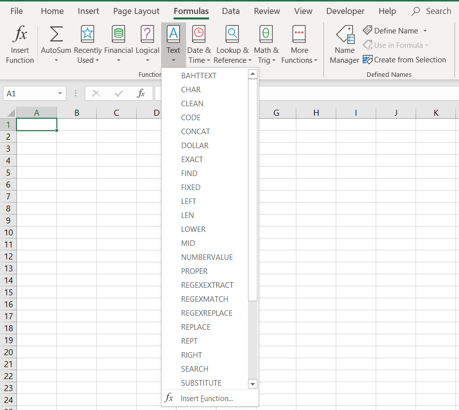

# Regular Expression Functions Excel Add-In
## Purpose and Features
- Translate regular expression functions from Google Sheets not currently supported in Microsoft Excel
## Compatibility
Microsoft Excel 2010+ (OS must be able to support regular expression object)
## Installation
1. Download 'Regular Expression Add-In 1.1.xlam'
2. Follow these [instructions](https://support.office.com/en-us/article/add-or-remove-add-ins-in-excel-0af570c4-5cf3-4fa9-9b88-403625a0b460) from Microsoft
## Usage
- The functions are located under the 'Formulas' tab under the 'Function Library' group in the 'Text' category (see images).
- Please use the following links for [tutorials](https://www.regular-expressions.info/tutorial.html) and [documentation](https://www.regular-expressions.info/vbscript.html) on regular expressions

| Function Name | Documentation |
| --- | --- |
| `REGEXMATCH()` | [Link](https://support.google.com/docs/answer/3098292) |
| `REGEXEXTRACT()` | [Link](https://support.google.com/docs/answer/3098244) |
| `REGEXREPLACE()` | [Link](https://support.google.com/docs/answer/3098245) |
## Sample Images

